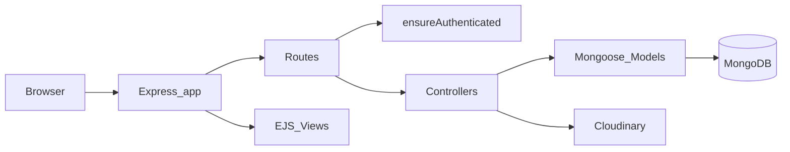

# InkFlow

A full-stack blog application for sharing posts, images, and comments.

InkFlow is a server-rendered blog built with Node.js and Express. Users can register, log in, create posts with image uploads, comment on posts, and manage their profiles. Images are stored on Cloudinary, sessions are persisted in MongoDB, and the UI is built with EJS templates styled with Bootstrap and Font Awesome.

## Features

- **Authentication** — Register, login, and logout via Passport local strategy (email + password with bcrypt hashing)
- **Posts** — Create, list, view, edit, and delete posts with up to 5 images per post (Multer + Cloudinary)
- **Comments** — Add, edit, and delete comments on post detail pages (author-only edit/delete)
- **User profiles** — View profile, edit username/email/bio, upload a profile picture, and delete account (cascade cleanup of posts, comments, files, and Cloudinary assets)
- **Authorization** — `ensureAuthenticated` middleware protects write routes; author checks in post and comment controllers
- **Sessions** — MongoDB-backed sessions via `connect-mongo`
- **UI** — Bootstrap and Font Awesome EJS templates

## Tech Stack

| Category | Technology |
|----------|------------|
| Runtime | Node.js (CommonJS) |
| Framework | Express 5 |
| Database | MongoDB + Mongoose |
| Authentication | Passport.js, express-session, bcryptjs |
| Views | EJS |
| File storage | Cloudinary, Multer, multer-storage-cloudinary |
| Other | dotenv, method-override, express-async-handler |

## Architecture



## Project Structure

```
InkFlow/
├── app.js                  # Application entry point
├── config/
│   ├── cloudinary.js       # Cloudinary configuration
│   ├── multer.js           # Multer upload middleware (Cloudinary storage)
│   └── passport.js         # Passport local strategy setup
├── controllers/
│   ├── authController.js   # Login, register, logout
│   ├── postController.js   # Post CRUD
│   ├── userController.js   # Profile management and account deletion
│   └── commentControllers.js # Comment CRUD
├── middlewares/
│   ├── auth.js             # ensureAuthenticated guard
│   └── errorHandler.js     # Global error handler
├── models/
│   ├── User.js
│   ├── Post.js
│   ├── Comment.js
│   └── File.js             # Tracks Cloudinary uploads
├── routes/
│   ├── authRoutes.js
│   ├── postRoutes.js
│   ├── userRoutes.js
│   └── commentRoutes.js
├── views/
│   ├── partials/           # header.ejs, footer.ejs
│   ├── home.ejs
│   ├── login.ejs
│   ├── register.ejs
│   ├── posts.ejs
│   ├── postDetails.ejs
│   ├── newPost.ejs
│   ├── editPost.ejs
│   ├── profile.ejs
│   ├── editProfile.ejs
│   ├── editComment.ejs
│   └── error.ejs
├── .env.example
├── package.json
└── README.md
```

## Prerequisites

- [Node.js](https://nodejs.org/) (LTS recommended)
- [MongoDB](https://www.mongodb.com/) instance (local or Atlas)
- [Cloudinary](https://cloudinary.com/) account (for image uploads)

## Installation

1. Clone the repository:

```bash
git clone <repository-url>
cd InkFlow
```

2. Install dependencies:

```bash
npm install
```

3. Create your environment file:

```bash
cp .env.example .env
```

4. Fill in the values in `.env` (see [Environment Variables](#environment-variables) below).

5. Start the server:

```bash
npm start
```

The app runs at `http://localhost:3000` by default (or the port set in `PORT`).

## Environment Variables

| Variable | Required | Description |
|----------|----------|-------------|
| `MONGODB_URI` | Yes | MongoDB connection string |
| `CLOUDINARY_NAME` | Yes | Cloudinary cloud name |
| `CLOUDINARY_API_KEY` | Yes | Cloudinary API key |
| `CLOUDINARY_SECRET` | Yes | Cloudinary API secret |
| `PORT` | No | Server port (default: `3000`) |

Example `.env`:

```env
MONGODB_URI=mongodb://localhost:27017/inkflow
CLOUDINARY_NAME=your_cloud_name
CLOUDINARY_API_KEY=your_api_key
CLOUDINARY_SECRET=your_api_secret
PORT=3000
```

## Scripts

| Command | Description |
|---------|-------------|
| `npm start` | Start the server (`node app.js`) |

## Routes

### Public

| Method | Route | Description |
|--------|-------|-------------|
| `GET` | `/` | Home page |
| `GET` | `/auth/login` | Login form |
| `POST` | `/auth/login` | Login submission |
| `GET` | `/auth/register` | Registration form |
| `POST` | `/auth/register` | Registration submission |
| `GET` | `/posts` | List all posts |
| `GET` | `/posts/:id` | Post detail with comments |

### Protected

Routes below require authentication (`ensureAuthenticated`).

| Method | Route | Description |
|--------|-------|-------------|
| `GET` | `/auth/logout` | Log out |
| `GET` | `/posts/add` | New post form |
| `POST` | `/posts/add` | Create post (multipart, max 5 images) |
| `GET` | `/posts/:id/edit` | Edit post form |
| `PUT` | `/posts/:id` | Update post |
| `DELETE` | `/posts/:id` | Delete post |
| `POST` | `/posts/:id/comments` | Add comment |
| `GET` | `/comments/:id/edit` | Edit comment form |
| `PUT` | `/comments/:id` | Update comment |
| `DELETE` | `/comments/:id` | Delete comment |
| `GET` | `/user/profile` | User profile |
| `GET` | `/user/edit` | Edit profile form |
| `POST` | `/user/edit` | Update profile (optional profile picture upload) |
| `POST` | `/user/delete` | Delete account and associated data |

## Data Models

### User

| Field | Type | Description |
|-------|------|-------------|
| `username` | String | Display name (required) |
| `email` | String | Login email (required) |
| `password` | String | Hashed password (required) |
| `profilePicture` | Object | `{ url, public_id }` |
| `bio` | String | User biography |
| `posts` | ObjectId[] | References to Post |
| `comments` | ObjectId[] | References to Comment |

### Post

| Field | Type | Description |
|-------|------|-------------|
| `title` | String | Post title (required) |
| `content` | String | Post body (required) |
| `author` | ObjectId | Reference to User (required) |
| `images` | Array | `[{ url, public_id }]` |
| `comments` | ObjectId[] | References to Comment |

### Comment

| Field | Type | Description |
|-------|------|-------------|
| `content` | String | Comment text (required) |
| `post` | ObjectId | Reference to Post (required) |
| `author` | ObjectId | Reference to User (required) |

### File

| Field | Type | Description |
|-------|------|-------------|
| `url` | String | Cloudinary image URL (required) |
| `public_id` | String | Cloudinary public ID (required) |
| `uploaded_by` | ObjectId | Reference to User (required) |

## Author

Krrish Kohli
